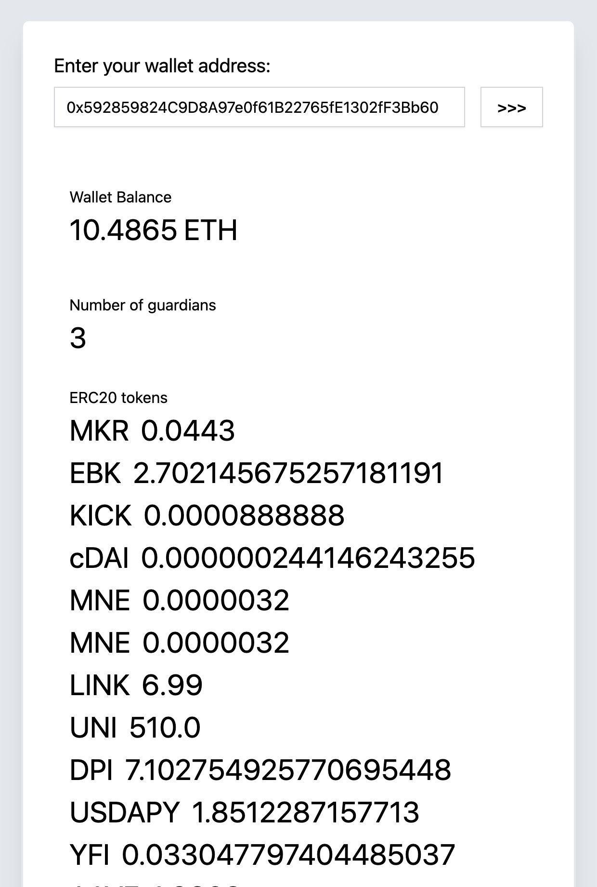

# Argent wallet checker



<br />
<br />

Live version is available at https://check-argent-wallet.vercel.app

### Built With

* [ReactJS](https://reactjs.org/)
* [Next.js](https://nextjs.org/)
* [Ethers.js](https://github.com/ethers-io/ethers.js/)
* [useDApp](https://github.com/EthWorks/useDApp)
* [React Hook Form](https://react-hook-form.com/)
* [Tailwind CSS](https://tailwindcss.com)
* [@sushiswap/default-token-list](@sushiswap/default-token-list)

### Installing and running

Simply clone the repository

```
git clone git@github.com:enemycnt/check-argent-wallet.git
cd check-argent-wallet
```

then install dependencies

```
yarn install
```

and finally run the app

```
yarn dev
```

Open [http://localhost:3000](http://localhost:3000) with your browser to see the result.


